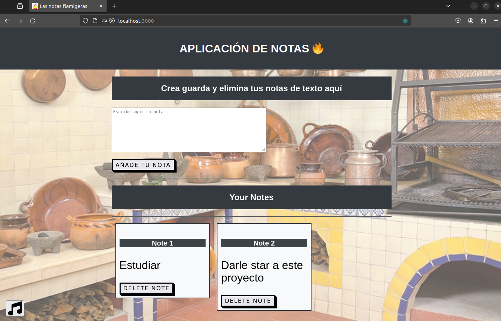

# Notas Flamigeras🔥





Esta aplicación web te permite crear, guardar y eliminar notas de texto de manera sencilla. Puedes acceder a ella desde tu navegador y utilizarla para organizar tus ideas, tareas pendientes o cualquier información importante que necesites recordar.

## Funcionalidades 🛠️

- **Creación de Notas**: Escribe tus notas en el área de texto proporcionada y luego presiona el botón "Añade tu nota" para guardarla.
  
- **Visualización de Notas**: Todas las notas guardadas se muestran en la sección "Your Notes". Cada nota se presenta en una tarjeta con un título numerado y su contenido.

- **Eliminación de Notas**: Si ya no necesitas una nota, simplemente haz clic en el botón "Delete Note" correspondiente a esa nota para eliminarla de la lista.

- **Reproductor de Música**: Disfruta de música mientras usas la aplicación. Haz clic en el botón con el ícono de música para iniciar la reproducción de música de fondo.

## Cómo Usar 📝

1. **Escribe tu Nota**: En el área de texto, escribe la nota que deseas guardar.

2. **Guardar Nota**: Haz clic en el botón "Añade tu nota" para guardar la nota.

3. **Visualizar Notas**: Todas tus notas guardadas se mostrarán debajo del área de texto.

4. **Eliminar Nota**: Si deseas eliminar una nota, haz clic en el botón "Delete Note" correspondiente a esa nota.

5. **Disfruta de la Música**: Para escuchar música de fondo, haz clic en el botón con el ícono de música.

## Tecnologías Utilizadas 💻💻

- **HTML y CSS**: Para la estructura y el estilo de la página web.
  
- **JavaScript**: Para la funcionalidad interactiva, como agregar y eliminar notas, así como la reproducción de música.

- **moment.js**: Una biblioteca de JavaScript para formatear y manipular fechas y horas.

## ¿Cómo Iniciar la Aplicación? 🚀

1. Clona este repositorio en tu máquina local.
   
2. Abre tu terminal y navega hasta el directorio donde clonaste el repositorio.

3. Ejecuta el siguiente comando para iniciar el servidor:
```
node server.js
```

4. Abre tu navegador web y visita `http://localhost:3000` para acceder a la aplicación.

5. ¡Comienza a escribir y organizando tus notas

